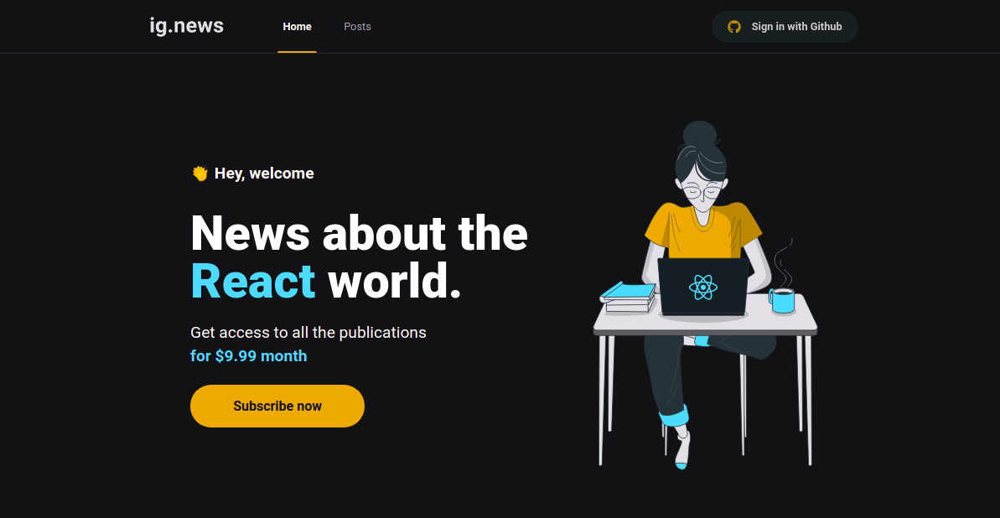
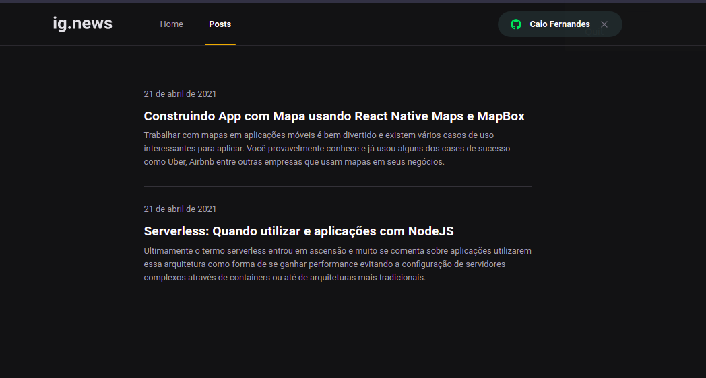
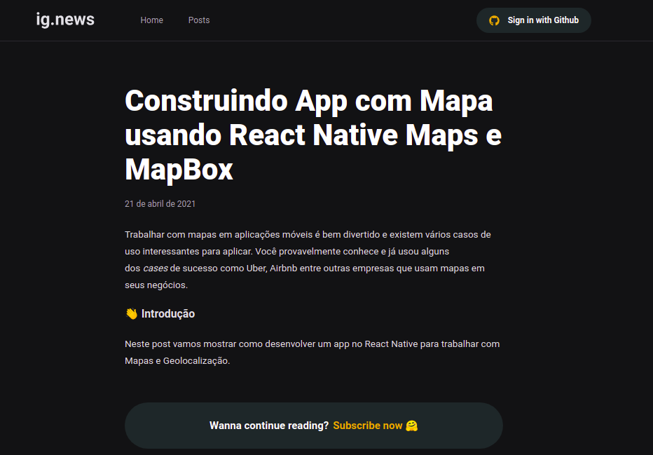

# Archived

This was made some time ago, I'm not gonna update but also I'm not gonna delete it, so I decided to archive

# Ignews

In this app, you can subscribe to have entire access to all newsletter

Project made by following the Ignite Bootcamp provided by Rocketseat

## Execute the project

- **yarn** to install the dependencies
- **yarn run dev** to execute the app
- Fulfill the **env.local** variables (use env.example)

## Stack

All the tools that I use for this project is listed bellow:

- **FaunaDB** (to store the users and subscriptions)
- **Stripe** (to handle subscriptions)
- **Next** (as the react framework)
- **Next-auth** (to handle authentication)
- **Prismic** (to handle the post creation)

## Preview

###### Homepage

###### Post session

###### Preview fo unauthenticated users

